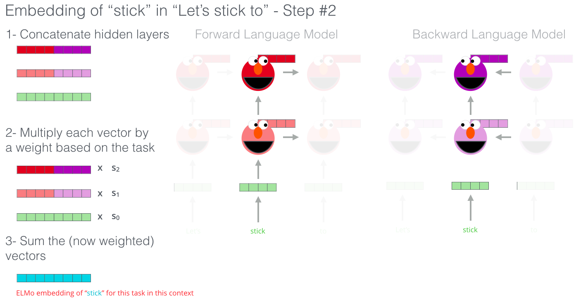

> 논문을 읽다 궁금한 Question Keyword를 정리한 글입니다. 잘못된 내용이나 설명이 있을 수 있습니다.

## Question Keyword

1. Transfer Learning (전이 학습)
2. Elmo
3. BERT
4. BLEU

## Reference

[1] [한국어 임베딩(이기창 지음, 2019)](https://ratsgo.github.io/natural%20language%20processing/2019/09/12/embedding/)

[2] [BERT: Pre-training of Deep Bidirectional Transformers for Language Understanding](https://arxiv.org/abs/1810.04805)

## 1. Transfer Learning

Transfer Learning(전이 학습)이란 이미 학습된 모델을 다른 딥러넹 모델의 입력값 또는 부분으로 재사용하는 기법이다. [1]

주로 Computer Vision 분야에서 사용되다가 [ELMo(Peters et al. 2018)](https://arxiv.org/abs/1802.05365) 논문을 기점으로 NLP 분야에서도 사용되기 시작했다.

NLP 분야에서는 모델을 **Pre-Train(사전 학습)** 시킨 뒤 **Downstream Task**에 적용하는 방식이다.

> DownStream Task란 구체적으로 풀고 싶은 문제 (Ex. QA, Sentiment Analysis 등)을 의미한다.

이때 Pre-Trained 모델을 Downstream Task에 맞게 업데이트하는 과정을 **Fine-Tuning(파인 튜닝)** 이라고 한다.

[이미지 출처](http://jalammar.github.io/illustrated-bert/)

[2] 위 그림을 보면 Pre-Train 된 BERT 모델을 Fine-Tuning 하여 Classification, QA, Tagging의 Downstream Task를 수행한다.

## 2. ELMo

> 이 친구 이름도 ELMO 입니다.

기존 Word2Vec나 Glove와 같은 단어 기반 Embedding 방식은 학습할 때만 문맥을 고려할 뿐, 다른 모델의 입력으로 사용될 때 고려하지 못한다는 한계를 가지고 있다.

예를 들어 단어 기반 임베딩은 _"저 바다 멀리 **배**가 떠 있다."_ 문장과 _"여기 과수원의 **배**는 맛있다."_ 문장에서 사용된 **배**의 의미의 차이를 모르고 같은 Vector로 표현하여 다른 모델의 입력으로 사용한다. ELMo는 이를 해결하기 위해 **문맥을 반영한 워드 임베딩(Contextualized Word Embedding)** 를 수행한다.

[이미지 출처](http://jalammar.github.io/illustrated-bert/)

[이미지 출처](http://jalammar.github.io/illustrated-bert/)

ELMo는 아래 그림과 같이 Forward Language Model과 Backward Language Model로 구성된 **BiLM**(**B**idirectional **L**anguage **Mo**del)을 사용한다.

[이미지 출처](http://jalammar.github.io/illustrated-bert/)

[이미지 출처](http://jalammar.github.io/illustrated-bert/)

ElMo가 사전 훈련(Pre-Train)된 BiLM을 통해 입력 문장으로부터 임베딩 벡터를 얻는 과정은 위와 같다.

## 3. BERT

> 이 친구 이름은 bert 입니다.
